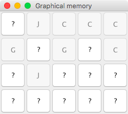

# Le jeu de mémoire

Le but de cet exercice est de concevoir un jeu de mémoire à partir des
classes et interfaces données afin de montrer la flexibilité apportée
par l'utilisation d'interfaces au lieu de classes concrêtes.

La classe `Cell` représente un objet affichable.

La classe `MemoryController` gère les règles du jeu de mémoire.

L'interface `Memory` représente la partie visible du jeu de mémoire, ainsi que l'interaction avec l'utilisateur.

L'interface `CharGenerator` représente un générateur de caractères le jeu : ce générateur doit assurer que chaque caractère apparaît par paire.
Une implémentation de cette interface, `RandomCharGenerator` est fournie et
sera utilisée pour démarrer cet exercice.

La classe `Game` permet de configurer le jeu, en déclarant les classes concrêtes à utiliser.

Pour l'instant, l'implémentation `FakeMemory` ne fait rien :

```bash
$ ./build.sh 
warning: [options] bootstrap class path not set in conjunction with -source 8
1 warning
added manifest
adding: dut/(in = 0) (out= 0)(stored 0%)
adding: dut/archilog/(in = 0) (out= 0)(stored 0%)
adding: dut/archilog/intro/(in = 0) (out= 0)(stored 0%)
adding: dut/archilog/intro/Cell.class(in = 919) (out= 544)(deflated 40%)
adding: dut/archilog/intro/CharGenerator.class(in = 312) (out= 188)(deflated 39%)
adding: dut/archilog/intro/Game.class(in = 539) (out= 333)(deflated 38%)
adding: dut/archilog/intro/MemoryControler.class(in = 2366) (out= 1157)(deflated 51%)
adding: dut/archilog/intro/RandomCharGenerator.class(in = 1090) (out= 638)(deflated 41%)
adding: dut/archilog/intro/Memory.class(in = 606) (out= 361)(deflated 40%)
adding: dut/archilog/intro/FakeMemory.class(in = 1310) (out= 624)(deflated 52%)
$ java -jar monapp.jar 
This is a fake game !
```

## Etape 1 : version texte

Dans cette première étape le joueur indiquera ses choix à l'aide du clavier.

Par exemple :

```
?????
?????
?????
?????

Quelle carte souhaitez-vous retourner ? 1 <= X <= 5  1<= Y <= 4 
4 1
???I?
?????
?????
?????

Quelle carte souhaitez-vous retourner ? 1 <= X <= 5  1<= Y <= 4 
4 2
???I?
???I?
?????
?????
```

1. Réaliser une implémentation `TextualMemory` de `Memory` permettant de jouer au jeu à partir de la ligne de commande.

2. Modifier le fichier `Game.java` pour utiliser cette nouvelle classe.

3. Produire le jar `monapp.jar` à l'aide du script `build.sh`.

4. Vérifier que le programme fonctionne comme attendu
    - que se passe t'il si vous entrez des valeurs hors bornes ?
    - que se passe t'il si vous sélectionnez deux fois la même carte ?
    - que se passe t'il si vous sélectionnez une carte déjà affichée ?

5. (Bonus) Créer une implémentation de `CharGenerator` qui va chercher les caractères dans un fichier.

## Etape 2 : version graphique

Dans une deuxième étape, on développera une interface graphique en swing.

Par exemple :



La façon précise de procéder va dépendre du framework d'implémentation (JavaFX ou Swing). Seule les principes sont donnés ci-après.

1. Créer une `Cell` particulière `GraphicalCell` qui connaît sa représentation graphique.

2. Réaliser une implémentation `GraphicalMemory` de `Memory` permettant de jouer au jeu graphiquement.

3. Modifier le fichier `Game.java` pour utiliser cette nouvelle classe.

4. Produire le jar `monapp.jar` à l'aide du script `build.sh`.

5. Vérifier que le programme fonctionne comme attendu.
    - que se passe t'il si vous entrez des valeurs hors bornes ?
    - que se passe t'il si vous sélectionnez deux fois la même carte ?
    - que se passe t'il si vous sélectionnez une carte déjà affichée ?
